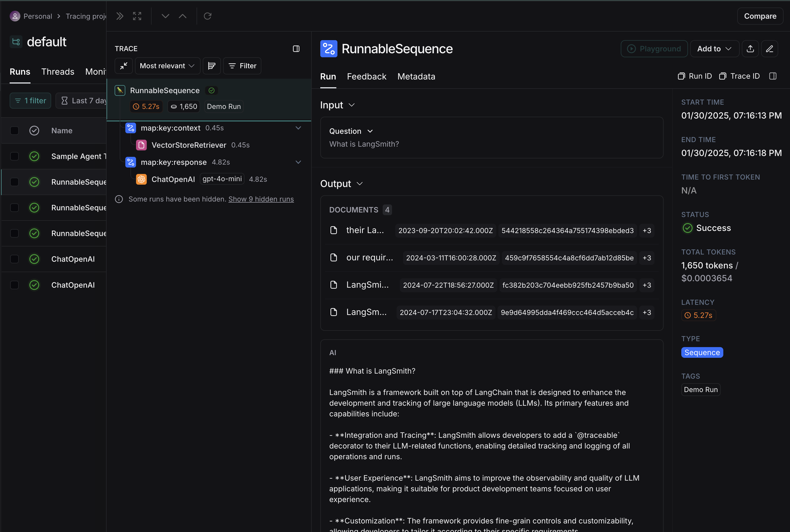
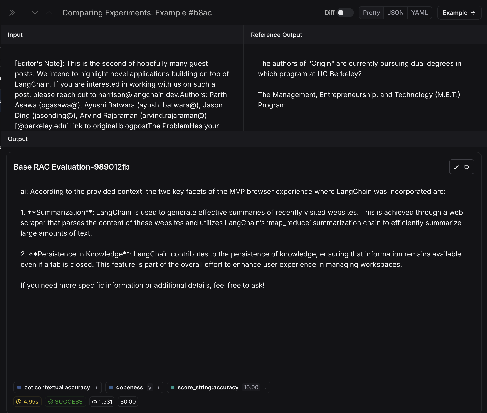

## Room 1

#### Question #1:

1. What other models could we use, and how would the above code change?
   - We can use any LLM model that provided by OpenAI platform. On other hand we can use other service like: Anthropic, DeepSeek or others.

#### Activity #1:

While there's nothing specifically wrong with the chunking method used above - it is a naive approach that is not sensitive to specific data formats.

Brainstorm some ideas that would split large single documents into smaller documents.

1. I think the most performant case would be when the data follows some structure rules, such as delimiters or separators. This will give us the most impact when comparing a chunker, no matter how generic it is.
2. Ideas for some "generic" chunker:
   - by data blocks (using some bottom and top size chars limit)
   - by delimiters / separators (like RecursiveCharacterTextSplitter from example)
   - by text structure objects (like headings, paragraphs, keywords, etc.)
   - we can ask AI to make some splitting for us (it can be some large-context and chip model)
   - some hybrid chunker that will combine the best aspects of previous chunkers to level out weaknesses
3. I'm using [Unstructured]("https://unstructured.io/") for some of my production pipelines and these guys are amazing.

#### Question #2:

1. What is the embedding dimension, given that we're using text-embedding-3-small?
   - 1'536 dims

#### Question #3:

What does LCEL do that makes it more reliable at scale?
   - by our incredible pipeline: _LCEL enhances reliability at scale through features such as fallbacks, which allow for graceful error handling due to the non-determinism of LLMs. Additionally, it supports parallelism, enabling components that can be executed concurrently to run in parallel, which is beneficial for handling long API calls typical in LLM applications. This structure contributes to a more robust and responsive system._
   - personal answer: I believe that the LCEL design is really close to Python arch design. All things are objects - since you get this knowledge, the whole process will go much easier. Same with LCEL, since all of our entities are runnables, we can use single interface to achieve any of our goals.

#### Question #4:
LangGraph's graph-based approach lets us visualize and manage complex flows naturally. How could we extend our current implementation to handle edge cases? For example:
- What if the retriever finds no relevant context?
  - Based on what we want to see. If we want our app strictly use provided context, then we're right here, we're okay. But if we want to enrich our generation, even if there is no context, I can offer to make the request to some search engine, like Google to search a relevant info. The idea is to extend our knowledge base with data from 3rd parties. We can mark these responses somehow like **Retrieved from external sources**
- What if the response needs fact-checking?
  - Here we will use the same approach from prev. step but with one and very important change. We will use only official, trusted and verified sources, that can provide us high-quality info. The mechanism itself can be simple LLM prompt. We will provide our initial response and some data from verified knowledge base. We then ask the LLM model to compare them and perform filtering/tuning/changes. Only after this we'll send the response to user

Consider how you would modify the graph to handle these scenarios.

## Room 2

#### Activity #2:
- Advanced system prompt provided

#### 🏗️ Activity #1:
Include a screenshot of your trace and explain what it means.

What we can get from trace:
1. How many prompt tokens were processed
2. `map:key` items shows our path through the chain
3. We can see that there were 4 context items found in our vector DB
4. If we go lower, we'll see final response generation
5. Also, some additional info like billing, tags, time-to-execute, 

#### Question #1 (Evaluation):
What conclusions can you draw about the above results?

- So here we can see that our response was cool (dopeness - `Y`)
- We also get max possible accuracy here, so we can say confidently that our expected output close to real one
- But this case have some troubles with `cot` (Chains-Of-Thought) evaluation, it can be easy detected by analyzing output.

Describe in your own words what the metrics are expressing.

So I processed 3 eval. cases and the idea of this task became very clear for me really fast. 

The idea of some custom evaluation, where we can design our self-built metrics and then test our app in incredibly smart.

This service / dashboard provided by LangChain is very intuitive as for me, so I can draw conclusions about the success of my build very fast.

The pre-built evaluators are also very important, so we can be sure that UX of our app will be on high level.