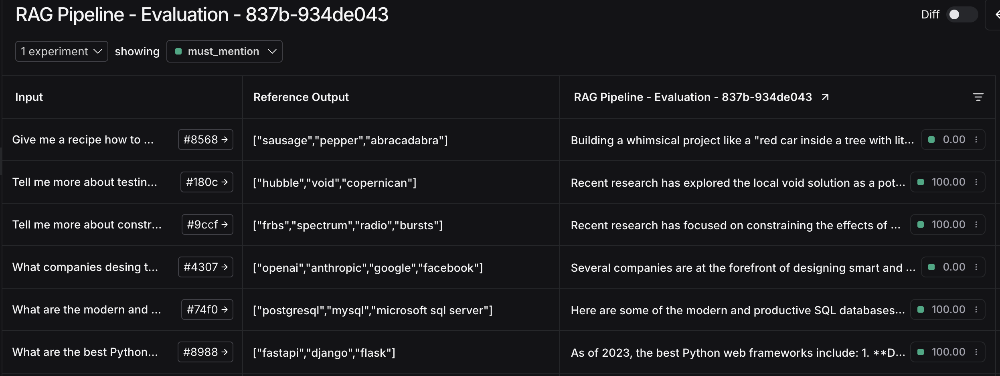

#### ❓ Question #1:

How does the model determine which tool to use?

So on current step we're using ChatOpenAI models like `gpt-4o-mini` that support OpenAI’s function calling (tool use). 
The possibility to choose the tool is provided to us from-the-box by LLM model.
Under the hood each pre-built tool from LangChain has its own description / instruction how and when the LLM should pick it for processing flow. 

So for example we can have 2 tools `X` and `Y`:
- `X` is knowledge base of all car models in the world
- `Y` is a simple search like Tavily

When user send query like: "Give me the fastest racing car in the world":
1. The model detects that the question is about cars
2. Then it will go to provided tools and it should choose the right tool:
    - The description of `X` says that it is the largest and most modern database engine.
    - The description of `Y` says that this should be used for general search.
3. Using this info the priority of tools should be: `X` -> `Y`

#### ❓ Question #2:

Is there any specific limit to how many times we can cycle?

At first run I thought that there is no restrictions by default
But then I asked ChatGPT and [read the docs](https://langchain-ai.github.io/langgraph/concepts/low_level/#recursion-limit) and no, there IS default limit of recursion depth that is `25`

If not, how could we impose a limit to the number of cycles?

There IS default recursion depth - `25`

LangGraph allows us to change this value as we wish using `recursion_limit`

#### Activity #2:

Please write out the steps the agent took to arrive at the correct answer.

1. Pass init query to agent
2. Agent said: go to `arxiv` tool with `"QLoRA"` request
3. Get data from `arxiv` tool and save to `State` object
4. Agent said: go to `tavily_search_results_json` tool with `Tim Dettmers Twitter` request
5. Get data from `tavily_search_results_json` tool and save to `State` object
6. Agent said: go to LLM with provided context and generate response
7. Return final response to user

So we made 1.5 of full circle in chain: agent-tool-agent-tool

#### ❓ Question #3:

How are the correct answers associated with the questions?

The way I see the process of creating a dataset for the evaluation process is that first of all we want our LLM to use 
the data that we have provided through our knowledge bases. 
So the goal of formulating the correct answers is to provide some specific, let's call them tags, specific and unique tags 
that are contained in our knowledge base, but are not contained in some general answer generation (I mean without any context).

Ofcourse we can speak about quality of generation itself, but I believe we can trust to LLM model devs, 
because this aspect should be on their side.

And as always I made some research of which aspects of LLM app should be tested using LangSmith evaluations and which are not. 

Here is the list:
1. ✅ Model Output Quality
   - Correctness & factual accuracy (Avoids hallucinations?)  
   - Relevance to the query (Does it stay on topic?)  
   - Coherence & fluency (Readable and well-structured?)  
   - Consistency across runs (Same input → same/similar response?)  
2. ✅ Chain & Agent Behavior 
   - Are the correct tools being called? (If using an agent)  
   - Does the chain execute the right steps?  
   - Are API/tool calls efficient? (Minimizing unnecessary calls)
3. ✅ Latency & Performance
   - Total response time (Does it meet SLAs?)  
   - Which step is the bottleneck?
4. ✅ Multi-Turn Memory & Context Handling
   - Does the LLM remember past interactions?
   - Does it forget irrelevant details?
5. ✅ Edge Cases & Robustness
   - How does the app handle vague/ambiguous queries?
   - Does it gracefully recover from errors?


1. 🚫 Hardcoded or Static Outputs
   - If an LLM app returns predefined responses for certain inputs, dynamic evaluation is unnecessary.
2. 🚫 Basic API Functionality 
   - No need to test whether external APIs (e.g., Tavily, Arxiv, OpenAI) work unless your integration modifies them.
3. 🚫 Training Data Quality
   - If you’re using a third-party model (e.g., GPT-4, Claude), you **cannot modify training data**, so testing it is redundant.
4. 🚫 Overtesting Stable Components
   - Once a model component works as expected, avoid excessive re-testing unless significant changes occur.  

#### ❓ Question #4:

What are some ways you could improve this metric as-is?

Here is my updated method:
```python
from langsmith.evaluation import EvaluationResult, run_evaluator

@run_evaluator
def must_mention(run, example) -> EvaluationResult:
    # Made it case-insensitive
    prediction = (run.outputs.get("output") or "").lower()
    required = example.outputs.get("must_mention") or []
    scores = [phrase.lower() in prediction for phrase in required]
    # Percentage of success, instead of true/false
    percentage = 100 * sum(scores) / len(scores) if scores else 0
    return EvaluationResult(key="must_mention", score=percentage)
```
Result:

