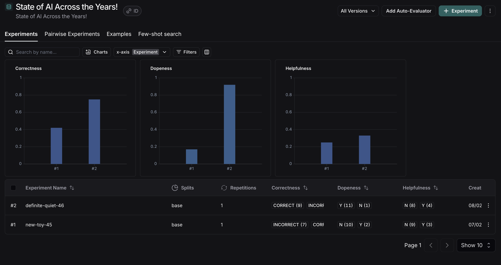

#### ❓ Question #1:

What are the three types of query synthesizers doing? Describe each one in simple terms.

So the main goal of any synthesizer is to generate one (or many) real use case with expected high quality answer, 
that we can compare with our app output to create some evaluation and visualization. 

We can use them to cover some percent of our application.

In future this test dataset should be extended with some manual data to achieve the most possible app quality.

Synthesizers and what do they generate:
- `SingleHopSpecificQuerySynthesizer`: test queries that require a single retrieval step to find the answer
- `MultiHopAbstractQuerySynthesizer`: test queries that require reasoning across multiple documents but formulates them in an abstract manner.
- `MultiHopSpecificQuerySynthesizer`: multi-hop test queries that explicitly mention key entities or details required for retrieval.

#### 🏗️ Activity #2:

#### 🏗️ Activity #2:

Highlight what each evaluator is evaluating.

- `qa_evaluator`: this one is the simple comparing of what we expect and what we've got, so we can name it "correctness" check
- `labeled_helpfulness_evaluator`: here we have strict desc of what should be tested (`config.criteria.helpfulness`) and this task will be handled by testing LLM
- `dope_or_nope_evaluator`: the same is here, we'll try to evaluate how cool, modern, youthful our responses are

Interesting things here are 1st arguments to all LangChainStringEvaluator`s, because it's some kind of work mode that can be different for each test case. And here are small list of use cases of these ones:

| Feature              | `labeled_criteria` | `criteria` | `qa` |
|----------------------|-------------------|------------|------|
| **Needs a reference answer?** | ✅ Yes  | ❌ No | ✅ Yes |
| **Needs a question as input?** | ❌ No  | ❌ No | ✅ Yes |
| **Use case** | Comparing against ground truth (fact-checking, QA) | Evaluating quality without ground truth (creativity, coherence) | Checking if the response correctly answers the given question |
| **Example criteria** | Accuracy, relevance | Coherence, fluency, engagement | Faithfulness, relevance, completeness |
| **Best for** | Fact-checking, correctness | Open-ended responses, style analysis | QA systems, chatbot evaluation |
| **Evaluation Basis** | Compares output to reference answer | Evaluates output based on qualitative measures | Checks if response is a valid and complete answer to the question |

#### ❓Question #2:

Why would modifying our chunk size modify the performance of our application?

I would say that in current case it's just more optimal batch size for our data format.
I mean how downloaded files are structured inside, the batch size of 1000 will contain more useful and high-quality context, 
that we can provide to LLM in the future.

But this approach only fits to current specific files, if we'll download some brand-new files with different structure, 
on contrary - this can decrease output generation quality. So the understanding that I can through our classes, that we can't 
rely only on good data, or only on good chunker. The best output will be only when we combine specific data with 
specifically configurated chunker that will handle this data.

I also intuitively think, that higher batch size will be processed faster since we have less items to process, 
so it's also performance of our app, because all of us like when app works fast.

#### ❓Question #3:

Why would modifying our embedding model modify the performance of our application?

This one pretty simple: the more dimensions we have in our models, the better the machine can "understand" our data, 
and therefore the better it can use and process it.

Another guess that I have regarding this one, more dimensions -> more data complexity -> speed of processing will decrease, like search f.e.

Also, more dimensions means that our data will take up more space in our databases.

So, as always, we need to balance between these configurations to find the best value for money.

I think that some abstractive value of 80-85% of success test metrics should be OK for most of LLM apps.

#### 🏗️ Activity #3:

Provide a screenshot of the difference between the two chains, and explain why you believe certain metrics changed in certain ways.

1. Correctness
    - The main reason here is that it is a smarter model to embed, so it can provide better machine understanding through higher dimensional vectors.
    - The second one is optimized for specific data chunker. V1 chunks were too small to reflect the context inside each chunk
2. Dopeness
    - Very simple here, it's all because of prompting. Adding the single line `You must answer the questions in a dope way, be cool!` changed the generation beyond recognition.
3. Helpfulness
    - Nothing really changed, just minor increasing, but still not good. We can fix it using prompting or adding another agent with some 3rd party knowledge base. I'll try to implement it, if I have enough time, because first I want to try hardmode activity.
