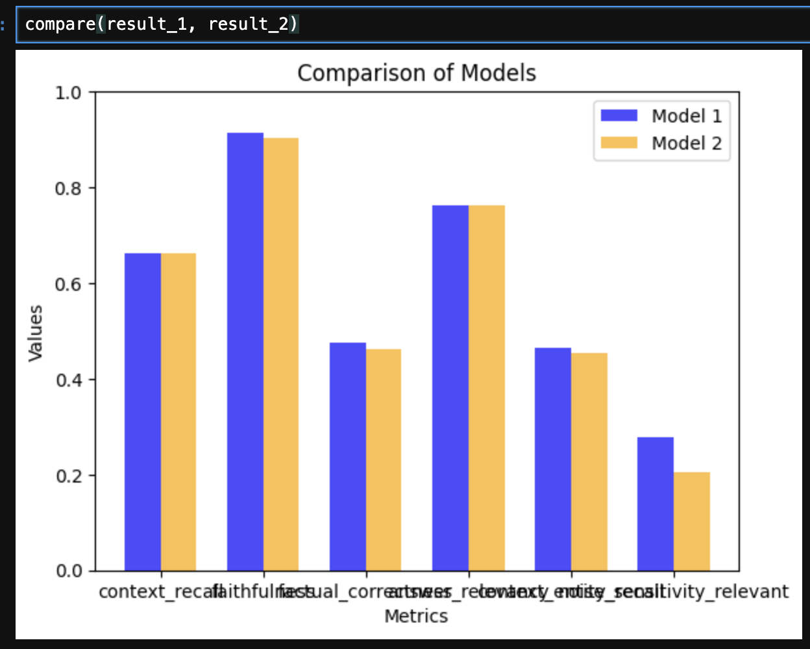

#### ❓ Question: 

Describe in your own words what a "trace" is.

I can describe it as the path that our program, state, or any other object has taken during its execution.

Path that we can fetch, analyze or debug for our purposes, and btw not only we, but also machines.

We can also compare it with chains, where each trace connected to neighbor trace, we have the first call and the last call of chain element.

#### ❓ Question: 

What is the purpose of the `chunk_overlap` parameter in the `RecursiveCharacterTextSplitter`?

`chunk_overlap` mean the number of symbols that will be "shared" between to neighbor chunks
Example with chunk_overlap = 3 and string "Abracadabra123Helicopter"
1. chunk n1 `Abracadabra123`
2. chunk n2 `123Helicopter`
3. shared part is `123` so it's the overlapping itself

The basic idea behind this approach is that we try to smooth the edges of our chunks so that the transition from 
chunk to chunk is not so abrupt, and we prevent some data loss at the chunk joints.

#### ❓ Question: 

Which system performed better, on what metrics, and why?

Here is my result

I made a little downgrade of models in jupyter notebook, because I get more high-quality test results during bonus activity app development.
But anyway, this case shows that evaluation with less powerful models is not too effective, so we need to set smarter model as "judge" model.
Cohere advanced search didn't affect our generation alot here, and I think that the main reason is that cohere will show its effectiveness with huge knowledge bases.
In our test case, the database has less than 100 items, so cohere doesn't have enough "room" to reach its potential.
So the simple cosine similarity fits the best for our case because of its simplicity and small DB size itself.
