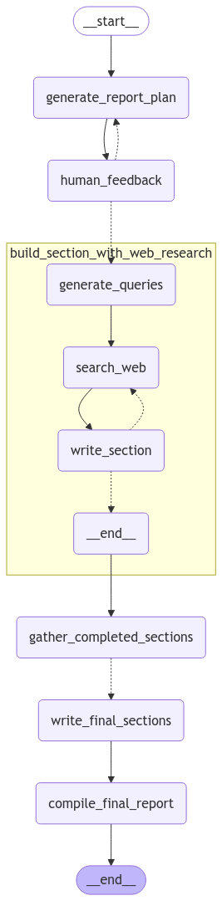

## Activity #1
How would we use RAGAS to evaluate this kind of application flow?

So the first idea that came to my mind is to split our app to smaller components and to test them.

I will call my approach the "RAGAS quantization" method.

### RAGAS Quantization
1. We need to split (quantize) our multi-component app to smaller pieces
2. So we can split it next way:
   1. `Report Plan Generation`. We can easily test it using RAGAS or some other service. We need some samples with good plan examples based on initial prompt. We can create our own evaluators, which will check the structure, headings and other things that must have in any plan.
   2. `Human Feedback`. We can test it using a chain of messages. For example, _Prompt: Please update the provided plan using next instructions {placeholder for instructions}._ Then we can evaluate it, compare initial plan with updated one using another LLM request
   3. `Sections`. Each section can be evaluated using default RAGAS flow. We can also check if the correct tool was called during the process (if we have multiple tools ofc.)
   4. `Final section`. Should be tested the same way as common one.
   5. `Gather sections & Compile final report`. No LLM calls. Should be tested via unit tests.
